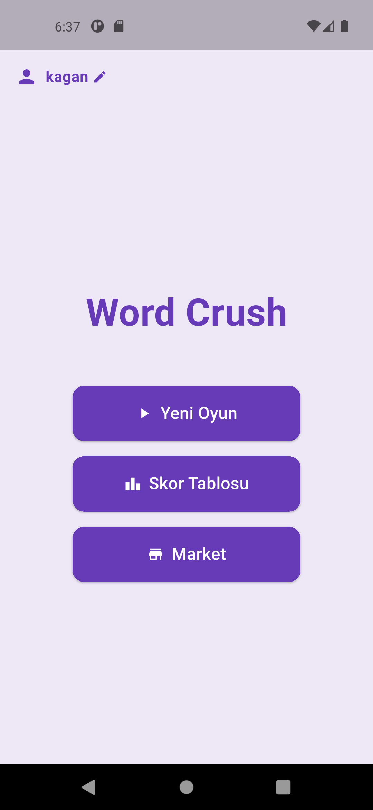
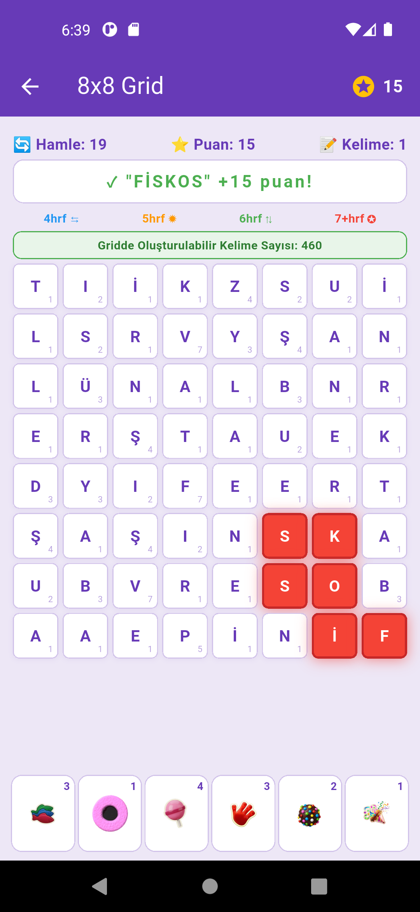
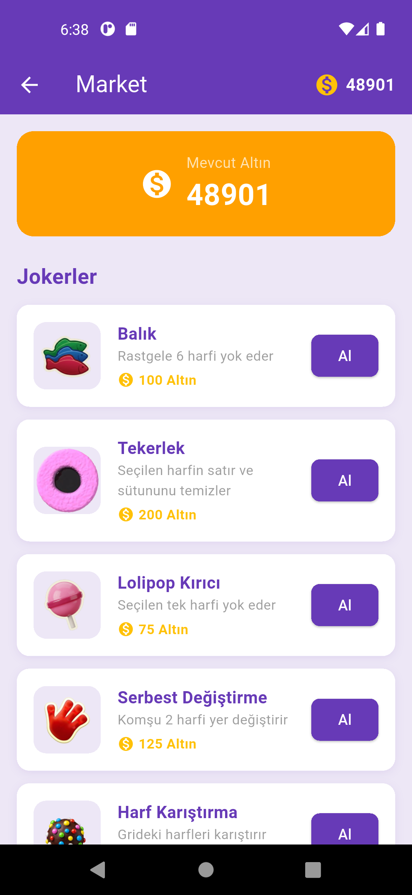

# Word Crush

A Turkish word puzzle mobile game built with Flutter and Dart. Players swipe through a letter grid to form valid Turkish words, earning points based on letter values and combo mechanics.

## Gameplay

### Main Menu


Select adjacent letters by dragging to form Turkish words. Longer words trigger special powers, and sub-words within a word earn bonus combo points. The game tracks moves, score, and found words in real time.

## Features

- Turkish letter frequency-based grid generation (based on corpus statistics)
- TDK-based Turkish dictionary validation with O(1) lookup
- DFS algorithm for real-time playable word count on the grid
- Combo mechanic — sub-words within a word earn bonus points
- 4-level special power system triggered by word length
- 6 purchasable jokers with an in-game gold economy
- Local data persistence with shared_preferences (offline, no login required)
- Score history with game details

## Special Powers

| Word Length | Effect |
|-------------|--------|
| 4 letters | Row clear |
| 5 letters | 3×3 area blast |
| 6 letters | Column clear |
| 7+ letters | 5×5 mega blast |

### Game Screen


## Jokers

| Joker | Price | Effect |
|-------|-------|--------|
| Fish | 100 | Removes 6 random letters |
| Wheel | 200 | Clears row and column of selected letter |
| Lollipop | 75 | Removes a single selected letter |
| Free Swap | 125 | Swaps 2 adjacent letters |
| Shuffle | 300 | Shuffles all letters on grid |
| Party Boost | 400 | Refreshes entire grid |

### Market


## Technologies

- Flutter / Dart
- shared_preferences (local storage)
- Android SDK

## Files

- `lib/` — Full Dart source code
- `assets/` — Word list and game assets
- `report.pdf` — Detailed project report

## Setup

```bash
flutter pub get
flutter run
```

Requires Flutter SDK 3.x and Android emulator or device.